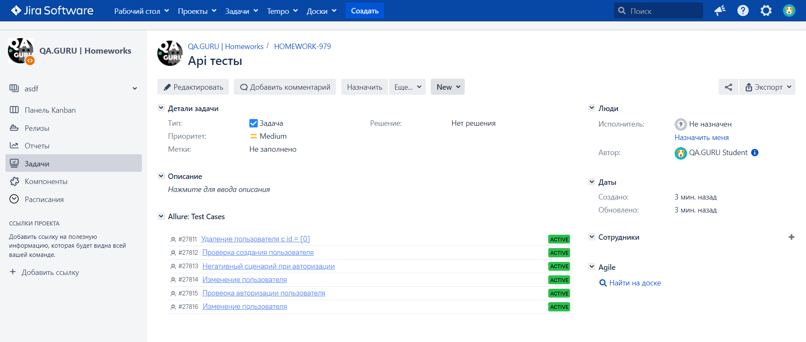

# Проект API тестов для сайта [Reqres.in](https://reqres.in/)

<p>
  
</p>

## Содержание:
+ [Стек технологий](#computer-использованный-стек-технологий)
+ [Тестовые сценарии](#clipboard-Тестовые-сценарии)
+ [Запуск тестов из терминала](#desktop_computer-Запуск-тестов-из-терминала)
+ [Сборка в Jenkins](#-Сборка-в-Jenkins)
+ [Интеграция с Allure report](#-Интеграция-с-Allure-report)
+ [Интеграция с Allure TestOps](#-Интеграция-с-Allure-testOps)
+ [Интеграция с Jira](#-Интеграция-с-Jira)
+ [Уведомления в Telegram](#-Уведомления-в-Telegram)

## :computer: Стек технологий

<p align="left"> 


</p>

## :clipboard: Тестовые сценарии
+ :white_check_mark: Проверка создания пользователя (CREATE)
+ :white_check_mark: Проверка удаления пользователя (DELETE)
+ :white_check_mark: Проверка авторизации (LOGIN - SUCCESSFUL)
+ :white_check_mark: Проверка изменения пользователя запросом put (UPDATE)
+ :white_check_mark: Проверка изменения пользователя запросом patch (UPDATE)

### Запуск тестов из терминала
```
gradle clean test
```

###  [Сборка в Jenkins](https://jenkins.autotests.cloud/job/pronyushkin_api_project/build?delay=0sec) 

Также можно переопределить параметры запуска:

```
clean
${TASK}
```

<p align="center">

</p>

##  <a href="https://jenkins.autotests.cloud/job/pronyushkin_api_project/10/allure/" target="_blank">Пример Allure-отчета</a>

<p align="center">

</p>

### Результат выполнения теста

<p align="center">

</p>

##  <a href="https://allure.autotests.cloud/project/3841/dashboards" target="_blank">Интеграция с Allure TestOps</a>

Выполнена интеграция сборки <code>Jenkins</code> с <code>Allure TestOps</code>.
Результат выполнения автотестов отображается в <code>Allure TestOps</code>
На Dashboard в <code>Allure TestOps</code> отображена статистика пройденных тестов.

<p align="center">

</p>
<p align="center">

</p>

##  <a href="https://jira.autotests.cloud/browse/HOMEWORK-979" target="_blank">Интеграция с Jira</a>

Реализована интеграция <code>Allure TestOps</code> с <code>Jira</code>. В задаче отображаются прикреплённые к ней тест-кейсы, а также результаты запусков/прохождения тестов.

<p align="center">

</p>


##  <a href="https://t.me/+W3sjUdH_PSk1Mjdi" target="_blank">Уведомления в Telegram с использованием бота</a> 


После завершения сборки, бот созданный в <code>Telegram</code>, автоматически обрабатывает и отправляет сообщение с результатом.

<p align="center">

</p>
